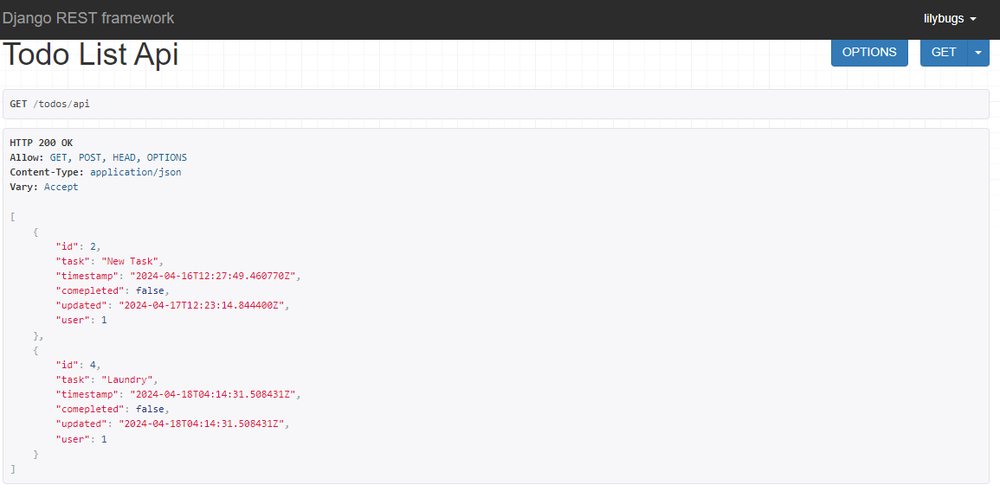
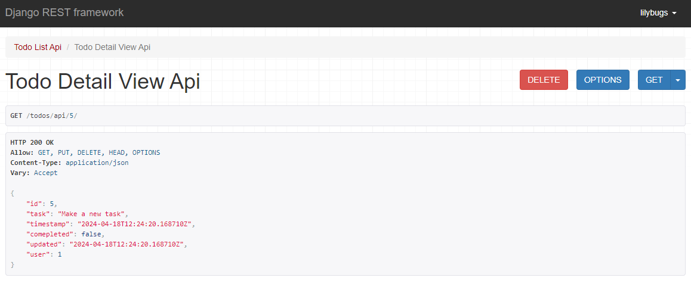
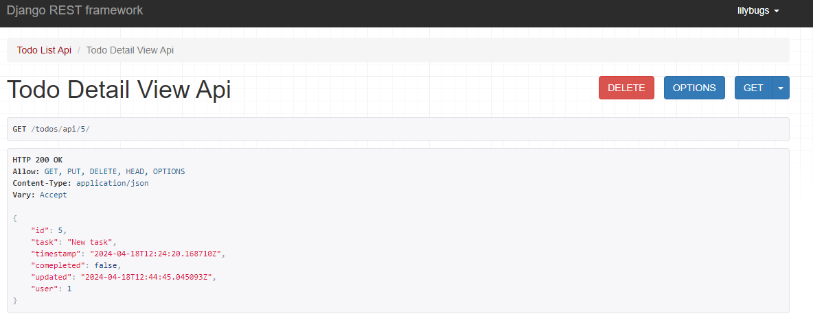

# Todo Application API

This application is a project assignment after reading about the REST framework used to develop apis. The application is able to utilize
HTTP resquests 'GET', 'PUT', 'DELETE', and 'POST' and also return a response.

## What is REST API
It stands for representational state transfer can be made up of one or more resources that can be accessed at a given URL and returned in various formats, like JSON, images, HTML, and more. REST API exposes useful functions and data.

## RESTful structure: 'GET', 'POST', 'PUT' and 'DELETE' methods
In a RESTful API, endpoints define the structure and usage of the above HTTP methods. I will demonstarte later with screen shots.

**Views for the project**
This section I will describe first the API views: List View and Detail View

**List View**
It deals with todos/api endpoint, which handles 'GET' for listing all todos of a given requested by a user and 'POST' for creating new todos.

**Detail View**
In this view I created three HTTP methods 'GET', 'DELETE', and 'POST' that request a todo item as requested by a specific user.

'PUT' method for task 5 {"task":"New task","completed":false}

*Note: I will continue with this project for example Authentication and permissions using JSON Web Token(JWT)*